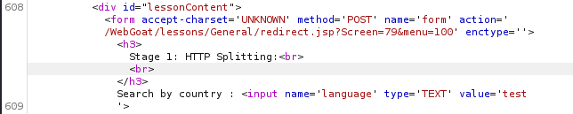
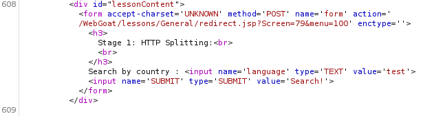
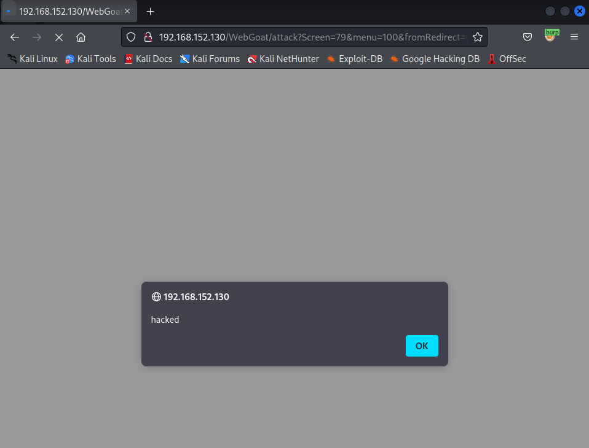

# OWASP WebGoat v5.4 General 풀이

## Http Basic

기본적인 http의 구성을 확인하는 문제로 패스

## Http Splitting (http 응답 분할공격)

해당 문제에서는 1. http splitting 공격을 시도하는 것 2. 1.에서 한 것을 토대로 Cache Poisoning을 시도하는 것이다.

http splitting 공격은 다음과 같다. 
> http request에 있는 파라미터가 response 응답헤더로 다시 전달되는 경우, 파라미터내 개행문자가 존재하면 http 응답이 분리될 수 있는 취약점을 활용하여 악의적인 코드를 삽입할 수 있음. (cwe-113 https://cwe.mitre.org/data/definitions/113.html)

cache poisioning 공격은 다음과 같다.
> 브라우저에서 웹 데이터를 빠르게 로드하기 위해 사용하는 캐시값에 악의적인 값을 넣어 서버에서 캐시를 호출할 경우 서비스를 정상적으로 사용하지 못하게 하거나 악의적인 동작을 하도록 함.

개행문자를 넣어 test%0d%0a 를 넣은 결과. 개행문자는 없어지고 test만 남았다. 평범해 보이지만...

html파일로 보면 개행이 되어 있음을 알 수 있다.

정상적인 html 파일과 비교.

그렇다면 이를 이용하여 cache poisioning을 시도해볼수 있다.

~~~
test
Content-Length: 0

HTTP/1.1 200 OK
Content-Type: text/html
Last-Modified: Wed, 21 Oct 2025 07:28:00 GMT
Content-Length: 45
<html></html>
~~~

해당 구문을 입력창에 넣을 것인데 (http://yehg.net/encoding/) 에 코드를 복사한 후, "encodeURIComponent"를 누르면 편하게 개행문자를 변환해준다.

성공한 모습